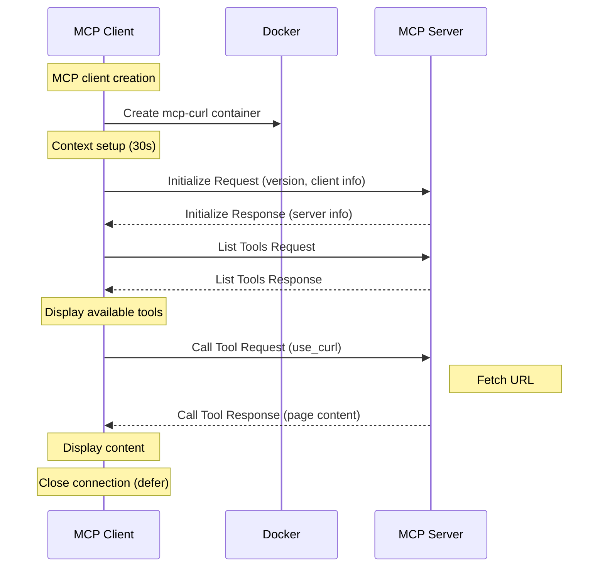
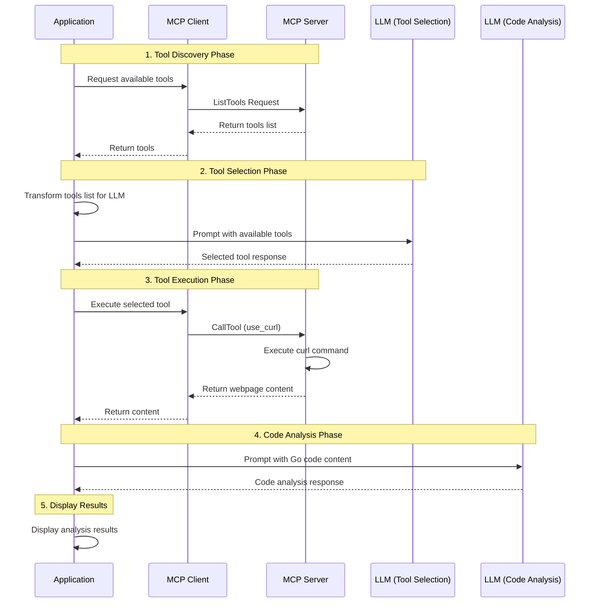
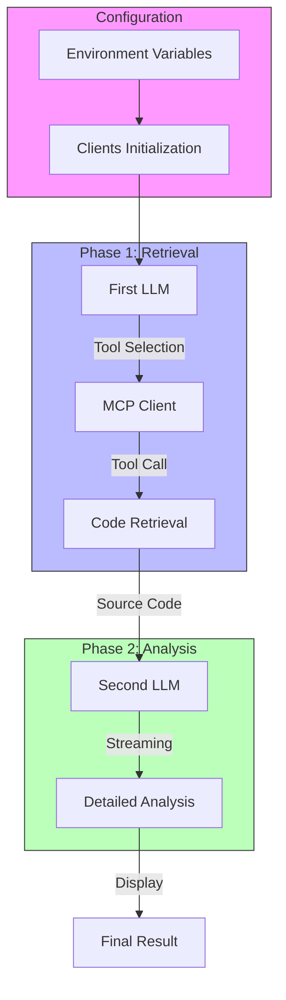

# Building a Generative AI MCP Client Application in Go using Ollama

## Introduction

In the [previous blog post](https://k33g.hashnode.dev/creating-an-mcp-server-in-go-and-serving-it-with-docker), we saw how to create our own **MCP** server in Go (the server offered a single tool to retrieve web page content using a `curl` command) and we saw how to use it with the `mcphost` CLI and Ollama.

Today we'll see how to create an **MCP** client application in Go that will connect to our MCP server and use the `curl` service to retrieve web page content.

This article will be composed of two parts:

- Writing an MCP client
- Writing a Generative AI application that uses the MCP client

Let's get started!

## Writing an MCP Client

As with the **MCP** server, we'll use the [https://github.com/mark3labs/mcp-go](https://github.com/mark3labs/mcp-go) library to write our **MCP** client.

Here's the source code first, which I'll explain afterward:

```go
package main

import (
    "context"
    "fmt"
    "log"
    "time"

    "github.com/mark3labs/mcp-go/client"
    "github.com/mark3labs/mcp-go/mcp"
)

func main() {

    // Create a new MCP client with the server data connection
    mcpClient, err := client.NewStdioMCPClient(
        "docker",
        []string{}, // environment variables
        "run",
        "--rm",
        "-i",
        "mcp-curl",
    )
    if err != nil {
        log.Fatalf("😡 Failed to create client: %v", err)
    }
    defer mcpClient.Close()

    ctx, cancel := context.WithTimeout(context.Background(), 30*time.Second)
    defer cancel()

    // Define and Initialize the MCP request
    fmt.Println("🚀 Initializing mcp client...")
    initRequest := mcp.InitializeRequest{}
    initRequest.Params.ProtocolVersion = mcp.LATEST_PROTOCOL_VERSION
    initRequest.Params.ClientInfo = mcp.Implementation{
        Name:    "mcp-curl client 🌍",
        Version: "1.0.0",
    }

    // Initialize the MCP client and connect to the server
    initResult, err := mcpClient.Initialize(ctx, initRequest)
    if err != nil {
        log.Fatalf("Failed to initialize: %v", err)
    }
    fmt.Printf(
        "🎉 Initialized with server: %s %s\n\n",
        initResult.ServerInfo.Name,
        initResult.ServerInfo.Version,
    )

    // Get the list of tools from the server
    fmt.Println("🛠️ Available tools...")
    toolsRequest := mcp.ListToolsRequest{}
    tools, err := mcpClient.ListTools(ctx, toolsRequest)
    if err != nil {
        log.Fatalf("😡 Failed to list tools: %v", err)
    }
    // Display the list of tools
    for _, tool := range tools.Tools {
        fmt.Printf("- %s: %s\n", tool.Name, tool.Description)
        fmt.Println("Arguments:", tool.InputSchema.Properties)
    }
    fmt.Println()

    // Prepare the call of the tool "use_curl" 
    // to fetch the content of a web page
    fmt.Println("📣 calling use_curl")
    fetchRequest := mcp.CallToolRequest{
        Request: mcp.Request{
            Method: "tools/call",
        },
    }
    fetchRequest.Params.Name = "use_curl"
    fetchRequest.Params.Arguments = map[string]interface{}{
        "url": "https://raw.githubusercontent.com/docker-sa/01-build-image/refs/heads/main/main.go",
    }

    // Call the tool
    result, err := mcpClient.CallTool(ctx, fetchRequest)
    if err != nil {
        log.Fatalf("😡 Failed to call the tool: %v", err)
    }
    // display the text content of result
    fmt.Println("🌍 content of the page:")
    fmt.Println(result.Content[0].(map[string]interface{})["text"])
}
```

### Explanations

This code is a program that establishes a connection with an **MCP** server and uses a `curl` tool to retrieve web page content. Here are the main steps:

**MCP Client Creation**:

The program creates a new MCP client that uses Docker to run an "mcp-curl" container (our previously developed MCP server). It configures basic parameters such as execution mode and environment variables.

```go
mcpClient, err := client.NewStdioMCPClient(
    "docker",
    []string{}, // environment variables
    "run",
    "--rm",
    "-i",
    "mcp-curl",
)
```

**Connection Initialization**:

1. The client sends an initialization request to the server with:
  - Protocol version
  - Client information (name and version)
2. The server will respond with its own information

```go
initRequest := mcp.InitializeRequest{}
initRequest.Params.ProtocolVersion = mcp.LATEST_PROTOCOL_VERSION
initRequest.Params.ClientInfo = mcp.Implementation{
    Name:    "mcp-curl client 🌍",
    Version: "1.0.0",
}
```

**Tool Discovery**:

The client requests the list of available tools from the server. For each tool, it displays:

- The tool name
- Its description
- Required arguments/parameters

```go
toolsRequest := mcp.ListToolsRequest{}
tools, err := mcpClient.ListTools(ctx, toolsRequest)
```

**Using the `use_curl` Tool**:

- A request is prepared to use the `use_curl` tool
- The target URL is specified in the arguments
- The tool is called and the page content is retrieved and displayed

```go
fetchRequest := mcp.CallToolRequest{
    Request: mcp.Request{
        Method: "tools/call",
    },
}
fetchRequest.Params.Name = "use_curl"
fetchRequest.Params.Arguments = map[string]interface{}{
    "url": "https://raw.githubusercontent.com/docker-sa/01-build-image/refs/heads/main/main.go",
}
```

#### Sequence Diagram



Save your go code (`main.go`). You can now run it using the command `go run main.go` and you should see the contents of the page displayed in your terminal:


```bash
🚀 Initializing mcp client...
🎉 Initialized with server: mcp-curl 1.0.0

🛠️ Available tools...
- use_curl: fetch this webpage
Arguments: map[url:map[description:url of the webpage to fetch type:string]]

📣 calling use_curl
🌍 content of the page:
package main

import (
    "fmt"
    "net/http"
)

func handler(w http.ResponseWriter, r *http.Request) {
    fmt.Fprintln(w, "Hola, Mundo!")
}

func main() {
    http.HandleFunc("/", handler)
    fmt.Println("Server listening on port 80...")
    if err := http.ListenAndServe(":80", nil); err != nil {
        fmt.Println("Error starting server:", err)
    }
}
```

Now let's see how to use this **MCP** client to build a Generative AI application.

## Building a Generative AI Application using the MCP Client

This time, the task will be a bit more complex:

- Our application will use the **MCP** client to "request" the list of available tools from the server
- Then, we'll need to transform this list of tools into a "comprehensible" list for the LLM and Ollama (the LLM must implement [`tools`](https://ollama.com/blog/tool-support) support)
- Next, we'll create a prompt to "ask" the LLM to choose a tool from its list of tools
- Once the tool is chosen, we'll send a request to the **MCP** server to execute the selected tool. So it's the **MCP** server that will handle executing the `curl` command to retrieve the web page content. This page is a piece of Go source code.
- Once the content is retrieved, we'll create a second prompt to ask another LLM to analyze the retrieved source code.
- And finally, we'll display the analysis result.

For the LLM with `tools` support, we'll use [qwen2.5:0.5b](https://ollama.com/library/qwen2.5:0.5b) and for source code analysis, we'll use [qwen2.5-coder:3b](https://ollama.com/library/qwen2.5-coder:3b).

> **Note**: depending on your use cases, you can use a single LLM for both tasks (but this LLM must implement `tools` support).

To summarize, the application should do this:



### Application Development

Before starting to write the application, we need a function to transform the list of tools provided by the **MCP** server into a list that is "understandable" by the LLM.

#### Development of Utility Functions

For this, I copied and used part of the Go code from the **`mcphost`** CLI application [https://github.com/mark3labs/mcphost/blob/main/pkg/llm/ollama/provider.go](https://github.com/mark3labs/mcphost/blob/main/pkg/llm/ollama/provider.go). We will have this:

```go
func ConvertToOllamaTools(tools []mcp.Tool) []api.Tool {
    // Convert tools to Ollama format
    ollamaTools := make([]api.Tool, len(tools))
    for i, tool := range tools {
        ollamaTools[i] = api.Tool{
            Type: "function",
            Function: api.ToolFunction{
                Name:        tool.Name,
                Description: tool.Description,
                Parameters: struct {
                    Type       string   `json:"type"`
                    Required   []string `json:"required"`
                    Properties map[string]struct {
                        Type        string   `json:"type"`
                        Description string   `json:"description"`
                        Enum        []string `json:"enum,omitempty"`
                    } `json:"properties"`
                }{
                    Type:       tool.InputSchema.Type,
                    Required:   tool.InputSchema.Required,
                    Properties: convertProperties(tool.InputSchema.Properties),
                },
            },
        }
    }
    return ollamaTools
}

// Helper function to convert properties to Ollama's format
func convertProperties(props map[string]interface{}) map[string]struct {
    Type        string   `json:"type"`
    Description string   `json:"description"`
    Enum        []string `json:"enum,omitempty"`
} {
    result := make(map[string]struct {
        Type        string   `json:"type"`
        Description string   `json:"description"`
        Enum        []string `json:"enum,omitempty"`
    })

    for name, prop := range props {
        if propMap, ok := prop.(map[string]interface{}); ok {
            prop := struct {
                Type        string   `json:"type"`
                Description string   `json:"description"`
                Enum        []string `json:"enum,omitempty"`
            }{
                Type:        getString(propMap, "type"),
                Description: getString(propMap, "description"),
            }

            // Handle enum if present
            if enumRaw, ok := propMap["enum"].([]interface{}); ok {
                for _, e := range enumRaw {
                    if str, ok := e.(string); ok {
                        prop.Enum = append(prop.Enum, str)
                    }
                }
            }

            result[name] = prop
        }
    }

    return result
}

// Helper function to safely get string values from map
func getString(m map[string]interface{}, key string) string {
    if v, ok := m[key].(string); ok {
        return v
    }
    return ""
}
```

The `ConvertToOllamaTools` function creates an array of tools in Ollama format, which includes:

- Function specifications
- Parameter definitions
- Type information
- Required fields
- Property descriptions

This converted format allows Ollama's LLM to understand and use the tools provided by the **MCP** server.

#### Writing the Application

> 👋 If you need more information about using the **"function calling"** principle with Ollama, you can read the previous blog post ["Tool Calling" and Ollama](https://k33g.hashnode.dev/tool-calling-and-ollama).

Here's the source code of the application reusing the previous **MCP** client code (a bit longer this time, but explanations follow right after):

```go
func main() {

	ctx := context.Background()

	var ollamaRawUrl string
	if ollamaRawUrl = os.Getenv("OLLAMA_HOST"); ollamaRawUrl == "" {
		ollamaRawUrl = "http://localhost:11434"
	}

    // LLM for function calling (tools selection)
	var toolsLLM string
	if toolsLLM = os.Getenv("TOOLS_LLM"); toolsLLM == "" {
		toolsLLM = "qwen2.5:0.5b"
	}

    // LLM for chat (code analysis)
	var chatLLM string
	if chatLLM = os.Getenv("CHAT_LLM"); chatLLM == "" {
		chatLLM = "qwen2.5-coder:3b"
	}

	url, _ := url.Parse(ollamaRawUrl)

	ollamaClient := api.NewClient(url, http.DefaultClient)

	mcpClient, err := client.NewStdioMCPClient(
		"docker",
		[]string{}, // environment variables
		"run",
		"--rm",
		"-i",
		"mcp-curl",
	)
	if err != nil {
		log.Fatalf("😡 Failed to create client: %v", err)
	}
	defer mcpClient.Close()

	// Create context with timeout
	ctx, cancel := context.WithTimeout(context.Background(), 30*time.Second)
	defer cancel()

	// Initialize the request
	fmt.Println("🚀 Initializing mcp client...")
	initRequest := mcp.InitializeRequest{}
	initRequest.Params.ProtocolVersion = mcp.LATEST_PROTOCOL_VERSION
	initRequest.Params.ClientInfo = mcp.Implementation{
		Name:    "mcp-curl client 🌍",
		Version: "1.0.0",
	}

    // Initialize the client
	initResult, err := mcpClient.Initialize(ctx, initRequest)
	if err != nil {
		log.Fatalf("Failed to initialize: %v", err)
	}
	fmt.Printf(
		"🎉 Initialized with server: %s %s\n\n",
		initResult.ServerInfo.Name,
		initResult.ServerInfo.Version,
	)

	// Get the list of tools
	fmt.Println("🛠️ Available tools...")
	toolsRequest := mcp.ListToolsRequest{}
	tools, err := mcpClient.ListTools(ctx, toolsRequest)
	if err != nil {
		log.Fatalf("😡 Failed to list tools: %v", err)
	}

	for _, tool := range tools.Tools {
		fmt.Printf("- %s: %s\n", tool.Name, tool.Description)
		fmt.Println("Arguments:", tool.InputSchema.Properties)
	}
	fmt.Println()

	// Define/Convert tool with Ollama format
	ollamaTools := ConvertToOllamaTools(tools.Tools)

	// Have a "tool chat" with Ollama 🦙
	// Prompt construction
	messages := []api.Message{
		{Role: "user", Content: "Fetch this page: https://raw.githubusercontent.com/docker-sa/01-build-image/refs/heads/main/main.go"},
	}

	var FALSE = false
	req := &api.ChatRequest{
		Model:    toolsLLM,
		Messages: messages,
		Options: map[string]interface{}{
			"temperature":   0.0,
			"repeat_last_n": 2,
		},
		Tools:  ollamaTools,
		Stream: &FALSE,
	}

	contentForThePrompt := ""

	err = ollamaClient.Chat(ctx, req, func(resp api.ChatResponse) error {

		// Ollma tools to call
		for _, toolCall := range resp.Message.ToolCalls {

			fmt.Println("🦙🛠️", toolCall.Function.Name, toolCall.Function.Arguments)
			// 🖐️ Call the mcp server
			fmt.Println("📣 calling", toolCall.Function.Name)
			fetchRequest := mcp.CallToolRequest{
				Request: mcp.Request{
					Method: "tools/call",
				},
			}
			fetchRequest.Params.Name = toolCall.Function.Name
			fetchRequest.Params.Arguments = toolCall.Function.Arguments

			result, err := mcpClient.CallTool(ctx, fetchRequest)
			if err != nil {
				log.Fatalf("😡 Failed to call the tool: %v", err)
			}
			// display the text content of result
			fmt.Println("🌍 content of the result:")
			contentForThePrompt += result.Content[0].(map[string]interface{})["text"].(string)
			fmt.Println(contentForThePrompt)
		}

		return nil
	})

	if err != nil {
		log.Fatalln("😡", err)
	}

	fmt.Println("⏳ Generating the completion: Code Analysis")

	// Have a "chat" with Ollama 🦙
	// Prompt construction
	messages = []api.Message{
		{Role: "user", Content: "Analyse this source code:"},
		{Role: "user", Content: contentForThePrompt},
	}

	var TRUE = true
	reqChat := &api.ChatRequest{
		Model:    chatLLM,
		Messages: messages,
		Options: map[string]interface{}{
			"temperature":   0.0,
			"repeat_last_n": 2,
		},
		Stream: &TRUE,
	}

    // Stream the result of the code source analysis
	answer := ""
	errChat := ollamaClient.Chat(ctx, reqChat, func(resp api.ChatResponse) error {
		answer += resp.Message.Content
		fmt.Print(resp.Message.Content)
		return nil
	})

	if errChat != nil {
		log.Fatalln("😡", err)
	}

}
```

#### Quick Source Code Explanation

This code implements an application that combines three main types of elements:

- An **MCP** client to access the **MCP** server
- A connection with Ollama for the artificial intelligence part
- Two different LLM models for specific tasks (tool selection and code analysis)

The main steps of the application are as follows:

- **Initial Configuration**
  1. Environment Variables Configuration
  2. Clients Initialization
    - Creating Ollama client for AI
    - Creating MCP client to access remote tools
- **Main Flow**
  1. MCP Client Configuration
    - Connection initialization
    - Retrieving available tools list
    - Converting tools to Ollama format
  2. First AI Interaction
    - Using the first LLM (**`qwen2.5:0.5b`**) to:
      - Analyze user request
      - Select appropriate tool
      - Prepare call parameters
  3. Tool Execution
    - Calling selected tool via MCP client
    - Retrieving web page content (source code)
  4. Code Analysis
    - Using the second LLM (**`qwen2.5-coder:3b`**) to:
    - Analyze retrieved source code
    - Generate detailed analysis
    - Display results in streaming

#### Flow Diagram



#### Running the Application

Save your go code (`main.go`). You can now run it using the command `go run main.go` and you should see the contents of the page displayed in your terminal, as well as the analysis of the source code.


```bash
🚀 Initializing mcp client...
🎉 Initialized with server: mcp-curl 1.0.0

🛠️ Available tools...
- use_curl: fetch this webpage
Arguments: map[url:map[description:url of the webpage to fetch type:string]]

🦙🛠️ use_curl map[url:https://raw.githubusercontent.com/docker-sa/01-build-image/refs/heads/main/main.go]
📣 calling use_curl
🌍 content of the result:
package main

import (
    "fmt"
    "net/http"
)

func handler(w http.ResponseWriter, r *http.Request) {
    fmt.Fprintln(w, "Hola, Mundo!")
}

func main() {
    http.HandleFunc("/", handler)
    fmt.Println("Server listening on port 80...")
    if err := http.ListenAndServe(":80", nil); err != nil {
        fmt.Println("Error starting server:", err)
    }
}

⏳ Generating the completion...
This is a simple Go program that sets up a basic HTTP server. Let's break it down:

1. **Package Declaration**: The `package main` statement indicates that this is the main package of the program, which means it will be executed when the program is run.

2. **Imports**: The program imports the `fmt` package for formatted I/O operations and the `net/http` package for handling HTTP requests and responses.

3. **Handler Function**: The `handler` function is defined to handle incoming HTTP requests. It takes two parameters: `w`, which is an `http.ResponseWriter` used to send the response back to the client, and `r`, which is an `*http.Request` containing information about the incoming request.

   Inside the `handler` function, `fmt.Fprintln(w, "Hola, Mundo!")` is used to print "Hola, Mundo!" to the client's browser.

4. **Main Function**: The `main` function is the entry point of the program.

   - `http.HandleFunc("/", handler)` sets up a route that maps the root URL (`/`) to the `handler` function. This means that whenever a request is made to the root URL, the `handler` function will be called to process the request.

   - `fmt.Println("Server listening on port 80...")` prints a message to the console indicating that the server is starting and listening on port 80.

   - `if err := http.ListenAndServe(":80", nil); err != nil` starts the HTTP server on port 80. The `nil` argument means that the server will use the default settings. If an error occurs during the server startup, it is caught and printed to the console.

In summary, this program creates a simple web server that listens on port 80 and responds with "Hola, Mundo!" to any request made to the root URL.
```

And there you have it! You now have a Generative AI application that uses an **MCP** client to fetch web page content and analyze it. You can of course customize this application to perform other tasks using the tool(s) available on the **MCP** server or even using other **MCP** servers.
